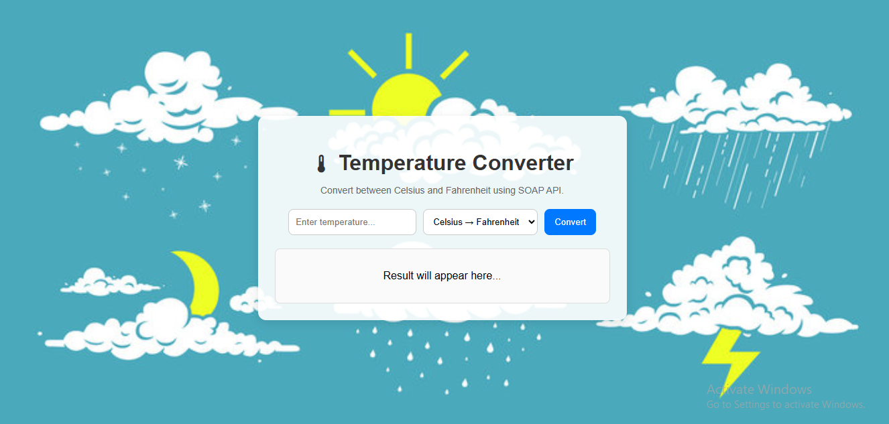
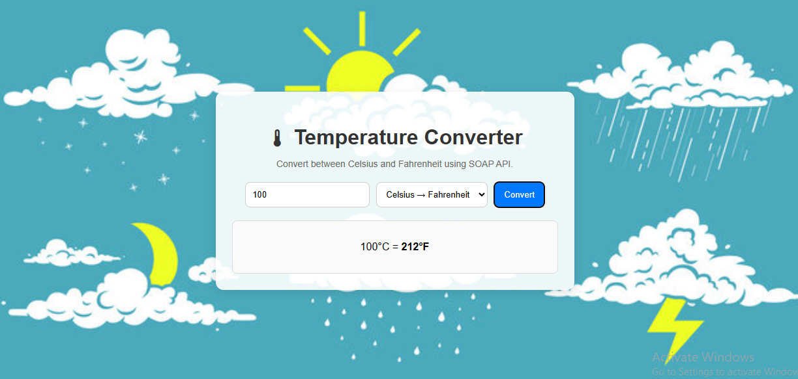
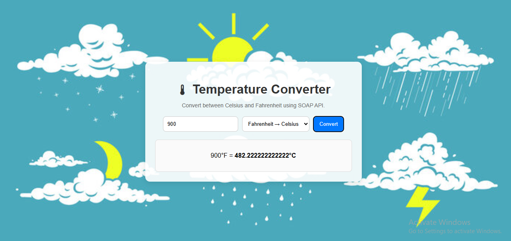

## 🌡 Temperature Converter (SOAP API)
A simple Temperature Converter Web App that uses the W3Schools SOAP API to convert temperatures between Celsius and Fahrenheit in real-time — directly from the browser.

## 🚀 Features
Convert Celsius → Fahrenheit and Fahrenheit → Celsius

Powered by SOAP API (tempconvert.asmx)

Simple & responsive UI with CSS styling

Error handling and loading indicators

Runs entirely on the frontend (no backend needed)

CORS Proxy integrated for cross-origin requests

## 🛠️ Tech Stack
HTML5 – Structure

CSS3 – Styling & Layout

JavaScript (ES6+) – API integration & functionality

SOAP API – Temperature conversion service

CORS Proxy – For bypassing cross-origin restrictions

## 📂 Project Structure
📦 Temperature-Converter
├── index.html       # Main HTML file
├── style.css        # Styling
├── script.js        # App logic & SOAP API calls
├── images/
│   └── bg.png       # Background image
└── README.md        # Project documentation

## 🔗 API Details
Base URL:
https://www.w3schools.com/xml/tempconvert.asmx
Methods Used:

CelsiusToFahrenheit – Converts °C to °F

FahrenheitToCelsius – Converts °F to °C

CORS Proxy Used:
https://corsproxy.io/?

## 💻 Usage
Clone the repository
git clone https://github.com/yourusername/temperature-converter-soap.git
Navigate to the project folder
cd temperature-converter-soap
Open index.html in your browser.
Enter a temperature, select conversion type, and click Convert.

## 🖼 Preview

